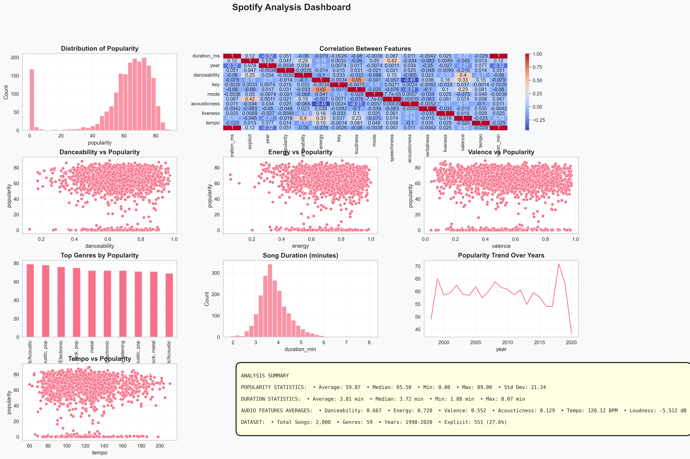

# Spotify Data Analysis – What Makes a Song Popular?

## Objective

The goal of this project is to analyze Spotify song data and identify factors that influence song popularity.

## Dataset

* Source: Spotify dataset (Kaggle)
* Number of songs: 2000
* Features: audio characteristics (danceability, energy, tempo, etc.)

## Technologies

* Python (Pandas, Matplotlib, Seaborn)
* Jupyter Notebook
* github Copilot

## Project Structure

- `data/` – dataset  
- `notebooks/` – analysis notebook  
- `images/` – visualizations and dashboard  

## Analysis Steps

1. Data loading and preprocessing
2. Feature engineering (song duration in minutes)
3. Exploratory Data Analysis (EDA)
4. Data visualization (histograms, scatter plots, heatmap, trends)
5. Dashboard creation

## Key Visualizations

* Distribution of song popularity
* Correlation heatmap between audio features
* Scatter plots (danceability, energy, valence vs popularity)
* Top genres by popularity
* Popularity trends over time

## Key Insights

### 1. No Strong Correlation

Audio features such as danceability, energy, valence, and tempo show weak correlation with popularity.

### 2. Popularity Is Not Determined by One Feature

No single variable strongly influences song success.

### 3. Genre Has Limited Impact

Different genres achieve similar levels of popularity.

### 4. Standard Song Duration

Most songs fall within the 2.5–4 minute range.

### 5. External Factors Matter

Popularity is likely influenced by factors not included in the dataset (e.g. marketing, artist recognition, trends).

## Dashboard

*Figure: Comprehensive dashboard analyzing Spotify song features and popularity*

## Conclusion

Song popularity cannot be explained solely by audio features. External factors play a significant role in determining a song’s success.

## Output

The project generates a complete Spotify analysis dashboard with multiple visualizations and summary statistics.
